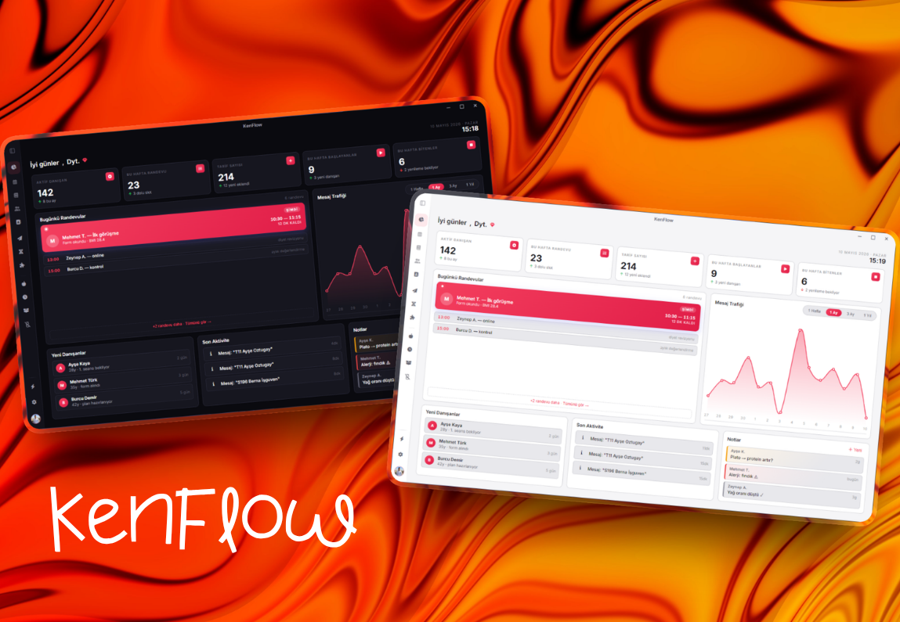

# KenFlow

**Diyetisyenler için danışan yönetimi ve WhatsApp mesaj otomasyonu.** WhatsApp Web üzerinden ön görüşme formunu okur, kişiye özel diyet PDF'i hazırlar ve gönderir. Tekrar eden mesajları kalıp sistemiyle otomatikleştirir.

[**📥 Son sürümü indir**](https://github.com/Kenfrozz/KenFlow-releases/releases/latest)

---

## Bu depo nedir?

Bu depo yalnızca **hazır kurulum dosyalarını** barındırır (kaynak kodu değil). KenFlow masaüstü uygulaması ve WhatsApp Chrome eklentisi buradan indirilir; uygulama açıldığında yeni sürümleri de otomatik olarak kendisi kontrol eder.

## Öne Çıkanlar

- 🔍 **Otomatik form okuma** — WhatsApp sohbetinden danışan formunu çekip kişiye özel diyet PDF'i üretir, tek tıkla gönderir
- 👥 **Kişilerim (otomatik kayıt)** — Bir kez taranan kişi bilgisi veri tabanında saklanır; sonraki işlemler anında çalışır
- 📅 **Randevu takibi** — Bugün / yarın / ileride / geçmiş randevuları tek ekranda görün, panelden tek tıkla kayıt
- ⚡ **Toplu işlemler** — Seçtiğiniz WhatsApp listesindeki herkese diyet, mesaj veya form taraması tek seferde
- 🍽️ **Akıllı tarif seçimi** — BMI'ye göre varyant, mevsim filtresi, diyet paketine göre otomatik öğün düzeni
- 🪪 **Diyetisyen kimlik kartı** — PDF kapağında foto + ad + telefon + sosyal medya ikonları
- 🔒 **Güvenlik** — Opsiyonel giriş şifresi, yerel SQLite veri tabanı yedekleme/geri yükleme

## Kurulum

### Windows
1. [Son sürüm](https://github.com/Kenfrozz/KenFlow-releases/releases/latest) sayfasından **`KenFlow-X.Y.Z-Setup.exe`** ve **`KenFlow-Extension-X.Y.Z.zip`** dosyalarını indirin.
   - Kurulum sihirbazı istemiyorsanız **`KenFlow-X.Y.Z-Portable.exe`** dosyasını tercih edebilirsiniz (kurulum gerektirmez, doğrudan çalışır).
2. Setup'ı çalıştırıp uygulamayı kurun.
3. Chrome'da `chrome://extensions` adresine gidin, sağ üstten **Geliştirici modu**'nu açın, indirdiğiniz zip'i bir klasöre çıkarıp **"Paketten yükle"** ile o klasörü seçin.

### Linux (Ubuntu/Debian tabanlı)
1. [Son sürüm](https://github.com/Kenfrozz/KenFlow-releases/releases/latest) sayfasından **`KenFlow-X.Y.Z-amd64.deb`** (veya AppImage tercih ederseniz **`KenFlow-X.Y.Z-x86_64.AppImage`**) ve **`KenFlow-Extension-X.Y.Z.zip`** dosyalarını indirin.
2. `sudo dpkg -i KenFlow-X.Y.Z-amd64.deb` komutuyla kurun.
3. Uygulama menüsünden **KenFlow**'u açın veya terminalde `kenflow` yazın.
4. Eklentiyi Windows adımlarındaki gibi Chrome'a "Paketten yükle" ile ekleyin.

### Ortak adımlar
- KenFlow'u başlatın — ilk açılış sihirbazı profil bilgilerinizi toplar.
- WhatsApp Web'de bir danışan sohbetine girin, yan panelden **Diyet Oluştur**'a tıklayın.

## Otomatik güncelleme

KenFlow açılışta yeni bir sürüm olup olmadığını kontrol eder ve varsa indirip kurmanızı önerir — Setup ile kurduysanız tekrar manuel indirmenize gerek kalmaz. Portable sürümü kullananlar güncellemeleri bu sayfadan elle takip etmelidir.

## Sürüm notları

Her sürümün altında o sürümde neyin değiştiği listelenir — bkz. [Releases](https://github.com/Kenfrozz/KenFlow-releases/releases).
